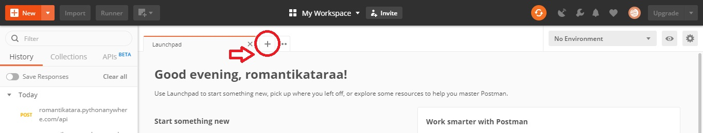
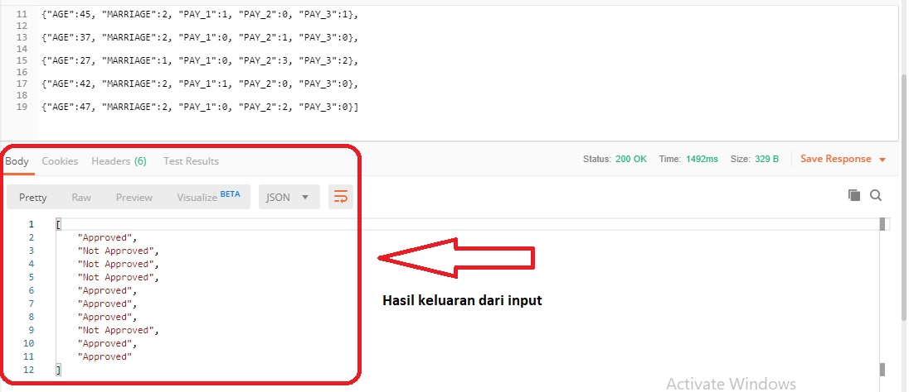

# Analytics Model Deployment

Model ini dibuat dengan memanfaatkan data record nasabah pelaku kredit dari data Astra Credit Scoring pada [Link ini](https://github.com/khairunisa6/Study-Case-Astra-Creditscore). Dataset tersebut berisi informasi terkait nasabah kartu kredit di suatu negara pada periode Januari - Maret 2015. Pada dataset terdapat 16 features yang terdiri dari ID, 14 prediktor dan 1 target. Ke-14 Prediktor tersebut terdiri atas usia, batas maksimal kredit, pendidikan, status pernikahan, jenis kelamin, pembayaran ke-1 2 dan 3, jumlah tagihan ke-1 2 dan 3, serta jumlah yang dibayarkan ke-1 2 dan 3.

## Credit Scoring Model

Pada model credit scoring ini digunakan metode random forest classifier dengan memanfaatkan 5 features yang dipilih dari dataset di atas. Features terpilih terdiri atas usia, status pernikahan, pembayaran ke-1 2 dan 3. Dari kelima features tersebut akan dibuat model credit scoring yang dapat mewakili karakteristik nasabah pelaku kredit di negara tersebut. Sehingga dapat dimanfaatkan untuk memprediksi nasabah lain di area yang sama apakah kredit yang diajukan dapat dipenuhi ataupun tidak.

Metode credit scoring yang digunakan pada dataset tersebut adalah dengan random forest classifier. Dengan model tersebut akan diketahui apakah nasabah keterangan dari 5 features terpilih akan diterima kreditnya ataupun ditolak kreditnya. Hal ini tentunya dapat membantu perusahaan untuk meminimalisir adanya risiko kredit yang ditimbulkan oleh nasabah.

## File Terlampir Pada Github
1. **modelcreditscoring.pkl** : model credit scoring dengan random forest classifier yang dimsimpen dalam ekstensi pickel. File ini dapat digunakan untuk deployment model dengan postman.
2. **modelcreditscoring.py** : model credit scoring dengan random forest classifier yang disimpan dalam ekstensi python. File ini dapat digunakan untuk deployment pada localhost server.
2. **serverCS.py** : file dengan ekstensi python yang digunakan untuk request POST, memuat kebutuhan untuk flask, dan untuk memanage API.
3. **requestCS.py** : berisi code python yang digunakan untuk memproses request POST ke server.

## Langkah-langkah Menjalankan Model Credit Scoring
Dalam hal ini akan dijelaskan langkah deployment model credit scoring dengan menggunakan postman.
1. Anda dapat membuka aplikasi postman.
2. Klik tanda "+" yang tertera disebelah launchpad pada tampilan postman.

3. Ubah pilihan default "GET" dibawah Untitled Request menjadi "POST".
4. Copy link berikut **romantikatara.pythonanywhere.com/api** dan jatuhkan pada "Enter URL request.

5. Klik "Body" pada deretan menu di bawah link.
6. Klik "Raw" pada pilihan menu "Body".

7. Open file "Testing 10 Input.txt" pada github ini.
8. Copy Input pada file .txt ke kotak dialog Raw Body.
9. (Opsional) Nilai pada masing-masing features dapat diubah dengan ketentuan:
    - Age: usia nasabah pelaku kredit dalam tahun
    - Marriage: status pernikahan nasabah. 1 = Belum Menikah, 2 = Menikah, 3 = Lainnya
    - Pay_1: waktu pembayaran tagihan bulan 1. 0 = Tidak Terlambat, 1 = Terlambat 1 bulan, dst.
    - Pay_2: waktu pembayaran tagihan bulan 2. 0 = Tidak Terlambat, 1 = Terlambat 1 bulan, dst.
    - Pay_3: waktu pembayaran tagihan bulan 3. 0 = Tidak Terlambat, 1 = Terlambat 1 bulan, dst.
10. Banyaknya row input yang ingin dilakukan dapat disesuaikan dengan keinginan, bisa dikurangkan ataupun ditambahkan. Jangan lupa untuk menyertakan pasangan kurung siku "[...]" di awal dan akhir.
11. Setelah input data selesai, klik "Send" untuk memanggil model yang tersimpan pada pythonanywhere.com sehingga dapat memproses model credit scoring.

12. Hasil akan muncul pada menu Body di bawah kotak dialog tersebut (Pilihan Pretty, Raw, dan Preview sama saja, hanya berbeda di tampilan keluarannya saja.
13. Jika terdapat kegagalan pada output, coba klik "Send" sekali lagi.

Selamat mencoba :)
